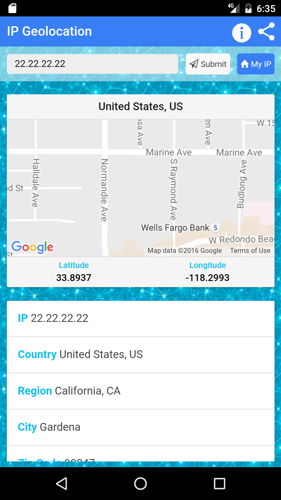

# [Ionic] IP Geolocation
A simple app that displays the location of your or any other IP address on a map, together with additional useful data
External IP, Country, Latitude, Longitude, City, Zip Code, Timezone, ISP, Organization, AS number/name

* External IP
* Country
* Latitude
* Longitude
* City
* Zip Code
* Timezone
* ISP
* Organization
* AS number/name

IP information given by this app are provided by this API [ip-api.com](http://ip-api.com/docs/api:json)

## About
I made this application just for test Ionic so there's no test and no specific build task.

## References

* [ip-api.com API Docs](http://ip-api.com/docs/)
* [IonicFramework Docs](http://ionicframework.com/docs/)

## License
MIT